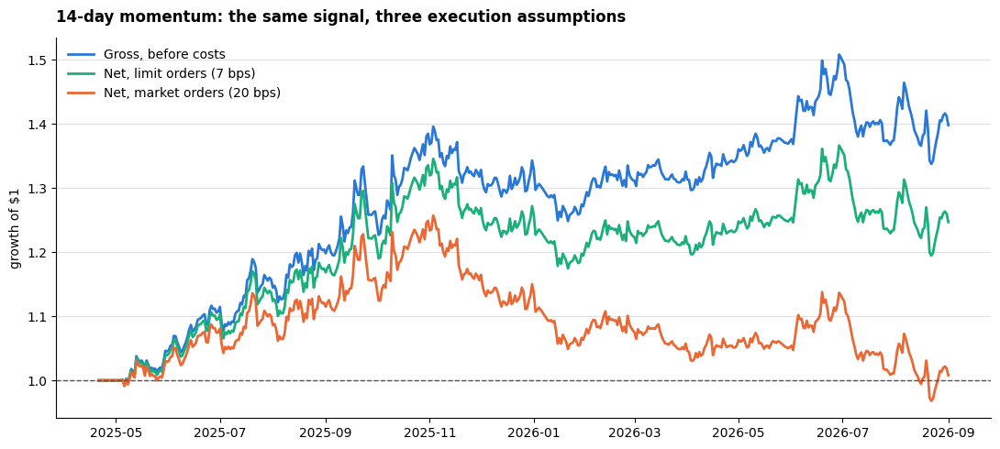

# Crypto Momentum: Does It Survive Trading Costs?

**Coins that went up recently tend to keep going up. Can you actually make money
on that after you pay to trade?**

That is the question. The short answer is that the signal is real, it is small,
and whether it is worth trading is decided almost entirely by **how** you
execute rather than by the signal itself.

Market-neutral long/short strategy across 5 crypto assets, backtested with
realistic costs and tested out of sample.

---

## The main result

The same signal, on the same data, with only the execution assumption changed:

| Execution | Annual return | Sharpe | Max drawdown |
|---|---|---|---|
| Before any costs | +26.4% | 1.37 | −11.3% |
| Limit orders (7 bps) | **+18.0%** | **0.93** | −12.7% |
| Market orders (20 bps) | +2.4% | 0.13 | −23.0% |

A Sharpe of 1.37 becomes 0.13 purely from how the trades are placed. Nothing
about the prediction changed.



---

## How it works

**The signal.** Add up each coin's returns over the past N days. Coins that
rose get a positive score, coins that fell get a negative one. The signal is
lagged one day, so it only ever uses information available before the trade.

**The positions.** Subtract the daily average across coins, then scale so the
book holds one dollar of positions. This means going long the coins doing
better than average and short the ones doing worse, which keeps the strategy
roughly market neutral. Measured beta against buy-and-hold Bitcoin is between
−0.02 and −0.09, confirming it.

**The costs.** Every day the positions change, and that change is turnover.
Cost is turnover multiplied by the fee rate. The project brief specifies 20
basis points for market orders and 7 for limit orders.

**Data.** 5 assets (BTC, ETH, SOL, ADA, AVAX), 499 daily bars pulled live from
Kraken through `ccxt`, roughly 1.4 years.

---

## What was found

### Turnover is the whole story

| Lookback | Daily turnover | Net Sharpe @ 20bps | @ 13bps | @ 7bps |
|---|---|---|---|---|
| 3-day | 0.79 | −2.77 | −1.74 | −0.85 |
| 7-day | 0.52 | −1.29 | −0.60 | −0.01 |
| **14-day** | **0.33** | **0.13** | **0.56** | **0.93** |
| 30-day | 0.24 | −1.72 | −1.35 | −1.04 |

Faster signals trade more and pay more. The 3-day version turns the book over
79% every day and loses more than half its value a year to fees alone.

The cost arithmetic is verifiable: `turnover × 20bps × 365 days` predicts the
gap between gross and net returns to within 0.2 percentage points at every
lookback. That is a useful check that the backtest does what it claims.

### There is a sweet spot in the middle

Gross Sharpe by lookback: 0.18 at 3 days, 0.68 at 7, **1.37 at 14**, and −0.67
at 30. Too short and you are trading noise. Too long and the momentum has
already faded into reversal.

### Out of sample, most of the edge disappears

Choosing the lookback on the first half of the data, then testing it on the
second half, which had no say in the choice:

| | Sharpe |
|---|---|
| Training half (14-day chosen here) | 1.72 |
| **Test half** | **0.27** |

The edge kept its sign and lost about 84% of its size. That gap is what
choosing a parameter by looking at the data costs you, and it is the reason a
backtest run over everything at once cannot be trusted alone.

---

## A bug worth documenting

An earlier version reported a **3.4% daily edge** and concluded that shorter
lookbacks were strongest.

The signal was being compared against the previous day's return, which is one
of the numbers already summed inside the signal. It was predicting a value it
already contained.

Two things are worth noting about it. A 3.4% daily edge compounds to roughly
5,000% a year, so the number was implausible on its face and should have been
questioned before it was celebrated. And the bug did not merely inflate the
results, it **reversed the conclusion**: corrected, 3-day is the *weakest*
lookback rather than the strongest.

---

## What this does not prove

- **The sample is short.** 1.4 years total, about 8 months per half. The
  standard error on an annualised Sharpe here is roughly ±1.2, so the 0.27
  out-of-sample result cannot be distinguished from zero. It is not evidence of
  an edge and not evidence against one.
- **Four lookbacks were tested and the best is reported.** The out-of-sample
  split only partly corrects for that.
- **Limit orders do not always fill.** The 7bps case assumes execution that may
  not be available when prices are moving quickly, which is exactly when a
  momentum strategy wants to trade.
- **Five assets, one exchange, one market regime.** Kraken serves only the most
  recent 500 daily bars, which caps the available history.

## Honest summary

Crypto momentum at a 14-day horizon showed a positive gross edge in this sample.
Whether it is tradeable depends on execution cost, not on the signal. Out of
sample the edge stayed positive but shrank to a level this much data cannot
distinguish from zero.

The useful finding is not a profitable strategy. It is that **execution cost,
not signal discovery, is the binding constraint on this idea.**

---

## Running it

```bash
python3 -m venv .venv && source .venv/bin/activate
pip install -r requirements.txt
jupyter notebook research.ipynb
```

Data is fetched live from Kraken, which returns only the most recent 500 daily
bars. Re-running on a later date gives a different window and therefore
different numbers.

Built for the final project of **The Wall Street Quants** course.
